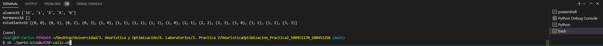

# HyO. Práctica 2 por 100451170 y 100451258
Proyecto 2 la asignatura "Heurística y Optimización" del grado de ingeniería informática, curso 3, cuatrimestre 1. Universidad Carlos III de Madrid.
  

## Requisitos
- Se recomienda usar Python 3.10.8
- Se recomienda usar un entorno virtual para instalar las dependencias
- Instalar las dependencias (en requirements.txt)
  

## Notas a leer
- Para entrar en el virtualenv (venv):

  - Windows: `venv\Scripts\activate.bat`
  - Linux: `source venv/bin/activate`
  - O simplemente añadir un nuevo terminal en VSCode y seleccionar el entorno virtual.
- Para instalar las dependencias (una vez dentro del venv):

  - `pip install -r requirements.txt`
- Para ver correctamente el color de los comentarios (!, ?, * ...) en el código, instalar la extensión "Better Comments" en VSCode.
- Para poder ejecutarlo correctamente, debemos ejecutar el archivo desde un Bash (el de git mismamente) (en VSCode, añadir un nuevo terminal y seleccionar bash). Si no, no funcionará correctamente.
   De todas maneras, se puede ejecutar desde Linux (recomendado).  Imágen de ejemplo de ejecución (*con el comando sh ./parte-1/code/CSP-calls.sh*): 
  
  

## TODO's
### Parte 1
- [X] Crear el repositorio
- [X] Crear el README.md
- [X] Crear el .gitignore
- [X] Crear el venv
- [X] Crear el requirements.txt
- [X] Externalizar las funciones
- [X] Crear la restricción de los hermanos
- [X] Crear la restricción de los hermanos
- [X] Crear la función write al archivo de salida
- [X] Sacar 3 soluciones DISTINTAS y ALEATORIAS
- [X] Crear el archivo .sh para ejecutar el código
- [ ] Eliminar variables (listas) no usadas
 

### Parte 2
- [ ] 
  

## Dudas a responder
### Parte 1
- [X] ¿Se debe seguir de forma estricta la distribución de los ficheros?
- [X] ¿Se puede usar el bus con posición vertical? Es más eficiente que el horizontal (que aparece en el pdf).
- [X] ¿Es necesario usar X, C y R's en las estructuras de las tuplas?
- [X] ¿Cuentan las puertas y el chofer como posiciones del bus? (de la misma forma que el pasillo no lo hace)
- [X] ¿Se han de crear listas externas o es irrelevante, tema de velocidad, optimización...?
- [X] ¿Afectan las pertas a los alumnos conflictivos (entre ciclo 1 y 2)? o ¿siguen tienendo que dejar espacio con otro conflictivos sin contar las puertas?
- [ ] ¿Se puede usar el formato de path: *python ./parte-1/code/CSPCargaBUS.py ./parte-1/CSP-tests/alumnos00*?
 

### Parte 2
- [ ] 
  